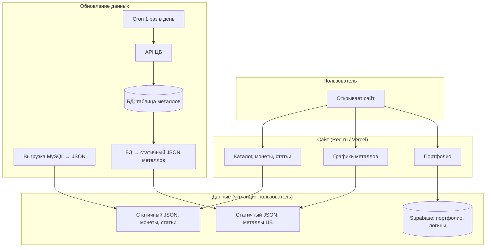

# Схема взаимодействия: монеты, статьи, портфолио, данные ЦБ

Схема того, что мы обсудили: откуда берутся данные, кто их обновляет, куда ходят запросы пользователя.

---

## Диаграмма (Mermaid)



**Цепочка для металлов (как обсуждали):** крон 1 раз в день → запрос к ЦБ → запись в БД → выгрузка из БД в статичный JSON → пользователь открывает графики и читает статичный JSON (запросов к ЦБ и к БД при просмотре нет).

---

## Общая схема

```
┌─────────────────────────────────────────────────────────────────────────────┐
│                              ПОЛЬЗОВАТЕЛЬ                                    │
│                    (открывает сайт: каталог, графики, портфолио)              │
└─────────────────────────────────────────────────────────────────────────────┘
                                      │
                    ┌─────────────────┼─────────────────┐
                    ▼                 ▼                 ▼
         ┌──────────────────┐ ┌──────────────┐ ┌──────────────────┐
         │  Монеты + статьи  │ │   Графики    │ │    Портфолио     │
         │  (каталог, дворы) │ │  (металлы)   │ │ (моя коллекция)  │
         └────────┬──────────┘ └──────┬───────┘ └────────┬─────────┘
                  │                   │                  │
                  ▼                   ▼                  ▼
         ┌──────────────────┐ ┌──────────────────┐ ┌──────────────────┐
         │  Статичный JSON   │ │  Статичный JSON  │ │    Supabase       │
         │  (монеты, статьи)│ │  (металлы ЦБ)    │ │  (auth +          │
         │  файлы на        │ │  обновляется     │ │   сохранённые     │
         │  Reg.ru/Vercel   │ │  кроном из БД    │ │   монеты)         │
         └────────┬──────────┘ └────────┬─────────┘ └────────┬─────────┘
                  │                    │                    ▲
                  │                    │                    │
         Запросов к БД при             │                    │ запросы при
         открытии страницы             │ Графики из статики │ входе и при
         НЕТ (просто файл)             │ (не из БД)         │ действиях в
                                       │                    │ портфолио
                                      │                  │
         ┌────────────────────────────┴───────────────────┘
         │
         ▼
┌─────────────────────────────────────────────────────────────────────────────┐
│                         ОБНОВЛЕНИЕ ДАННЫХ                                   │
├─────────────────────────────────────────────────────────────────────────────┤
│                                                                             │
│  1. МОНЕТЫ И СТАТЬИ                                                         │
│     Ты добавил монеты в MySQL → выгрузка MySQL → JSON →                     │
│     → замена файлов (Reg.ru по FTP / Vercel: push + деплой).                 │
│     Картинки монет — в папку coins. Пользователь видит новое после обновления│
│     файлов.                                                                 │
│                                                                             │
│  2. ДАННЫЕ ЦБ (МЕТАЛЛЫ)                                                     │
│     Раз в день:                                                             │
│     Один крон раз в день, один скрипт — два шага подряд в одном запуске:     │
│     (1) Запрос к API ЦБ → запись в БД (MySQL или Supabase).                  │
│     (2) Чтение из БД → выгрузка в статичный JSON (файл металлов).            │
│     Два отдельных крона не нужны.                                            │
│     Пользователь открывает графики → читает статичный JSON. Запросов = 0.    │
│                                                                             │
│  3. ПОРТФОЛИО                                                               │
│     Обновляется при действиях пользователя: вход, добавление/удаление       │
│     монет из коллекции. Supabase — единственное хранилище для этого.       │
│                                                                             │
└─────────────────────────────────────────────────────────────────────────────┘
```

---

## Кто что хранит

| Данные              | Где хранятся        | Кто обновляет                    | Запросы пользователя к БД |
|---------------------|---------------------|----------------------------------|-----------------------------|
| Монеты, статьи      | Статичный JSON      | Ты (выгрузка из MySQL → файлы)  | 0                           |
| Цены металлов (ЦБ)  | БД (MySQL или Supabase) + статичный JSON | Cron 1 раз в день: ЦБ → БД → выгрузка в JSON | 0 (графики из статичного JSON) |
| Портфолио, логины   | Supabase            | Пользователь (действия на сайте)| Да (при входе и в портфолио) |

---

## Роль сервисов

| Сервис    | Роль |
|-----------|------|
| **Reg.ru** | Хостинг сайта (или только домен), MySQL для монет/статей и при желании для металлов, Cron + PHP для обновления данных ЦБ (если выбрали вариант A). |
| **Supabase** | Только портфолио и пользователи: регистрация, вход, сохранённые монеты в коллекции. |
| **Vercel** | По желанию: хостинг приложения, Cron для ЦБ (вариант B), или только домен/редирект. |
| **ЦБ** | Внешний источник цен металлов; к нему обращается только крон 1 раз в день, не пользователь. |

---

## Поток данных (кратко)

1. **Пользователь открывает каталог/главную** → сайт отдаёт статичный JSON (монеты, статьи). Запросов к MySQL/Supabase нет.
2. **Пользователь открывает графики** → сайт отдаёт статичный JSON (металлы). Запросов к ЦБ и к БД нет.
3. **Пользователь входит или меняет портфолио** → запросы к Supabase (auth и сохранённые монеты).
4. **Раз в день** — крон: (1) запрос к ЦБ → запись одной строки в БД; (2) выгрузка из БД в статичный JSON (металлы). Пользователь потом читает только этот JSON.
5. **Когда ты добавил монеты** — выгрузка из MySQL в JSON, обновление файлов и при необходимости картинок; после этого пользователи видят новый каталог.
